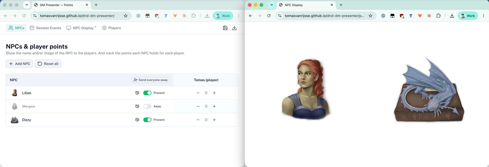

# DM Presenter

Session tools for a roleplay game master, use a second screen like an iPad to display the NPCs to the players.

https://tomasvanrijsse.github.io/dnd-dm-presenter/



## NPCs & Points

The home page (`/`) is a grid of the NPCs (rows) against the players (columns). Each cell tracks how many points
that NPC holds for that player. Points can go negative.

Points can be used for admiration, kudos, loans, gambles etc.

- **Add NPC** opens a form to create an NPC (name, image path, rich-text description). Clicking an NPC's name or
  avatar opens a view of their description.
- The handshake icon for an NPC row will make the name appear on the NPC display.
- **Reset all** clears every point and reset it to zero. It leaves the away and introduced flags alone.

It is not shared across machines or browsers.

## Session Events

The `/session-events` page tracks what happens round by round. **Add row** creates a row with an editable title
(defaults to `Round N`) and a description of what's happening. Drag names from **Unassigned** into a group, or

## Players

The `/admin` page manages the players used across every other page: add, edit, and remove players (name).

## AI image generation

The `/admin` page also holds the Leonardo.ai API key and the style prompt used when generating NPC portraits
(the "Generate with AI" option on an NPC form). Get a key at
[app.leonardo.ai/api-access/api-keys](https://app.leonardo.ai/api-access/api-keys). Tip for the style prompt:
upload an image whose art style you like into an LLM and ask it to describe that style in words suitable for an
image-generation prompt, then paste the result in. Both fields are stored only in this browser.

## Display

**Open display** opens `/present` in a new tab — a full-screen, white-background grid of the portraits of every NPC
that is currently *not* away. One NPC fills the whole screen; more NPCs tile side by side, growing into more rows as
the count goes up. If an NPC has been marked **Introduced** their name appears beneath their portrait; otherwise only the portrait shows.
Put it on a second screen or projector for the players and drive the away/introduced status from `/` on
your own screen. Since both pages read the same `localStorage` state, changes on `/` update the display live, even
across windows.

## Save & Load

All the data that you enter is only available within that browser on that machine.
You can store everything into a zip file.
This way you can prepare for multiple sessions or reuse the data on a different machine.

# Development

## Setup

Install dependencies:

```bash
pnpm install
```

## Development Server

Start the development server on `http://localhost:3000`:

```bash
pnpm dev
```

## Checks

```bash
pnpm lint
pnpm typecheck
```

Locally preview production build:

```bash
pnpm preview
```
